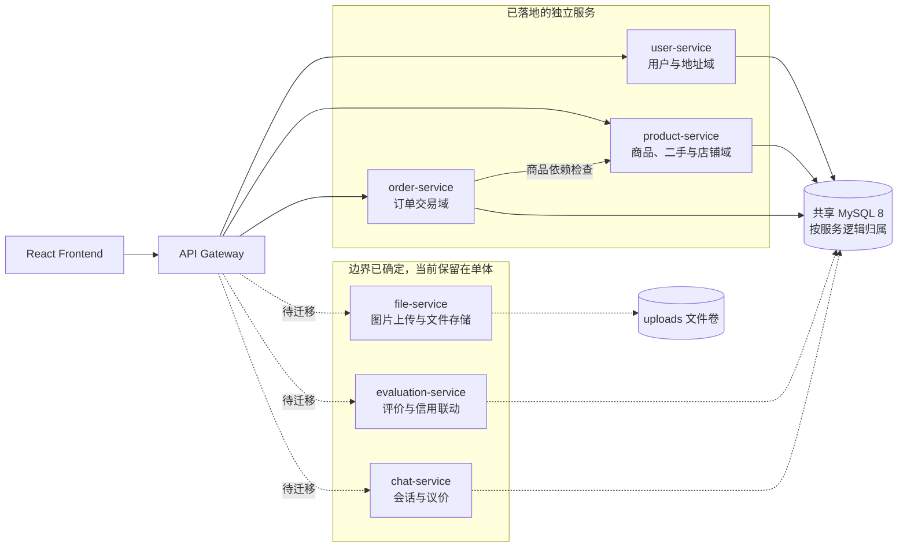

# 微服务划分、服务接口与数据归属方案

## 1. 文档范围与验收口径

本文是中期检查中“微服务划分图、服务接口清单和数据表归属方案”的统一交付物。项目采用渐进式拆分：单体后端继续承载 UC01-UC09 的完整业务，独立部署的微服务实验版已经落地 API Gateway、用户服务、商品服务和订单服务，用于验证服务边界、路由、故障降级、容器化及 Kubernetes 部署。

| 状态 | 含义 |
| --- | --- |
| 独立服务已实现 | `services/` 中已有可运行接口，并由微服务测试和 CI 验证 |
| 单体已实现，待迁移 | 完整业务接口已在 `backend/` 运行，目标归属已确定，但尚未迁入独立服务 |
| 规划 | 属于目标架构，不作为当前已落地能力宣称 |

## 2. 微服务划分图

**图 MS-SPLIT：微服务边界、落地状态及数据归属。实线表示已落地的独立服务调用，虚线表示已确定边界但仍由单体承载的迁移目标。**

可编辑 Mermaid 图源：

### 2.1 服务职责和代码位置

| 服务 | 目标职责 | 当前状态 | 代码位置 |
| --- | --- | --- | --- |
| API Gateway | 统一入口、路由、透传认证、超时和 503 降级 | 独立服务已实现 | `services/api-gateway/` |
| user-service | 注册登录、用户资料、密码、信用信息、收货地址 | 查询演示接口已独立；完整业务在单体 | `services/user-service/`, `backend/routes/user.js`, `backend/routes/address.js` |
| product-service | 商品、二手商品、库存、搜索、推荐和店铺资料 | 查询演示接口已独立；完整业务在单体 | `services/product-service/`, `backend/routes/product.js`, `backend/routes/secondhand.js`, `backend/routes/shop.js` |
| order-service | 创建订单、支付、取消、发货、收货和订单查询 | 查询及依赖降级已独立；完整交易在单体 | `services/order-service/`, `backend/routes/order.js` |
| evaluation-service | 评价、审核、回复、商品评分和卖家信用联动 | 单体已实现，待迁移 | `backend/routes/evaluation.js` |
| chat-service | 会话、消息、议价申请及一次性处理 | 单体已实现，待迁移 | `backend/routes/chat.js` |
| file-service | 图片类型/大小校验、文件保存和访问地址生成 | 单体已实现，待迁移 | `backend/routes/upload.js`, `backend/uploads/` |

评价、聊天和上传服务在图中明确标为待迁移，不虚构尚不存在的独立进程。店铺和地址分别并入商品域和用户域，避免十天实践中拆出职责过小的服务。

## 3. 服务接口清单

### 3.1 API Gateway 和独立微服务现有接口

| 服务 | 方法 | 路径 | 认证 | 状态与说明 |
| --- | --- | --- | --- | --- |
| api-gateway | GET | `/health` | 公开 | 独立服务已实现，网关健康检查 |
| api-gateway | GET | `/version` | 公开 | 独立服务已实现，返回版本和路由表 |
| api-gateway | ALL | `/api/users/**` | 透传 JWT | 独立服务已实现，转发用户域 |
| api-gateway | ALL | `/api/products/**` | 透传 JWT | 独立服务已实现，转发商品域 |
| api-gateway | ALL | `/api/secondhand/**` | 透传 JWT | 独立服务已实现，转发二手商品域 |
| api-gateway | ALL | `/api/orders/**` | 透传 JWT | 独立服务已实现，转发订单域 |
| api-gateway | ALL | `/api/shops/**` | 透传 JWT | 规划，迁移商品域完整接口时加入 |
| api-gateway | ALL | `/api/addresses/**` | 透传 JWT | 规划，迁移用户域完整接口时加入 |
| api-gateway | ALL | `/api/evaluations/**` | 透传 JWT | 规划，评价服务独立后加入 |
| api-gateway | ALL | `/api/chats/**` | 透传 JWT | 规划，聊天服务独立后加入 |
| api-gateway | ALL | `/api/uploads/**` | 透传 JWT | 规划，文件服务独立后加入 |
| user-service | GET | `/health`, `/version` | 公开 | 独立服务已实现 |
| user-service | GET | `/api/users` | 公开演示 | 独立服务已实现，返回用户列表样例 |
| user-service | GET | `/api/users/:id` | 公开演示 | 独立服务已实现，包含 404 分支 |
| product-service | GET | `/health`, `/version` | 公开 | 独立服务已实现 |
| product-service | GET | `/api/products` | 公开 | 独立服务已实现，支持压测参数 `burnMs` |
| product-service | GET | `/api/products/:id` | 公开 | 独立服务已实现，包含 404 分支 |
| product-service | GET | `/api/secondhand` | 公开 | 独立服务已实现 |
| order-service | GET | `/health`, `/version` | 公开 | 独立服务已实现 |
| order-service | GET | `/api/orders` | 公开演示 | 独立服务已实现 |
| order-service | GET | `/api/orders/health/dependencies` | 公开 | 独立服务已实现；商品服务失败时返回 206/degraded |

### 3.2 user-service 目标业务接口

| 方法 | 路径 | 认证 | 状态与业务目标 |
| --- | --- | --- | --- |
| POST | `/api/users/register` | 公开 | 单体已实现，注册并返回用户和 JWT |
| POST | `/api/users/login` | 公开 | 单体已实现，校验密码并返回 JWT |
| GET | `/api/users/profile` | JWT | 单体已实现，查询当前用户资料 |
| PUT | `/api/users/profile` | JWT | 单体已实现，修改当前用户资料 |
| PUT | `/api/users/password` | JWT | 单体已实现，校验旧密码后修改密码 |
| GET | `/api/addresses` | JWT | 单体已实现，查询当前用户地址 |
| PUT | `/api/addresses` | JWT | 单体已实现，整体替换并保证唯一默认地址 |

### 3.3 product-service 目标业务接口

| 方法 | 路径 | 认证 | 状态与业务目标 |
| --- | --- | --- | --- |
| GET | `/api/products` | 公开 | 单体已实现，筛选、排序和分页 |
| GET | `/api/products/search` | 公开 | 单体已实现，关键词搜索 |
| GET | `/api/products/recommended` | 公开 | 单体已实现，推荐商品 |
| GET | `/api/products/mine` | JWT | 单体已实现，查询本人发布商品 |
| GET | `/api/products/:id` | 公开 | 单体及独立服务均已实现 |
| POST | `/api/products` | JWT | 单体已实现，创建普通商品 |
| PUT | `/api/products/:id` | JWT + 所有者 | 单体已实现，编辑商品 |
| DELETE | `/api/products/:id` | JWT + 所有者 | 单体已实现，删除商品 |
| GET | `/api/secondhand` | 公开 | 单体及独立服务均已实现 |
| GET | `/api/secondhand/search` | 公开 | 单体已实现，搜索二手商品 |
| GET | `/api/secondhand/:id` | 公开 | 单体已实现，查询二手商品详情 |
| POST | `/api/secondhand` | JWT + 已认证店铺 | 单体已实现，发布二手商品 |
| PUT | `/api/secondhand/:id` | JWT + 所有者 | 单体已实现，编辑二手商品 |
| DELETE | `/api/secondhand/:id` | JWT + 所有者 | 单体已实现，删除二手商品 |
| GET | `/api/shops/mine` | JWT | 单体已实现，查询或建立本人店铺 |
| PUT | `/api/shops/mine` | JWT | 单体已实现，维护店铺资料 |
| POST | `/api/shops/mine/verification` | JWT | 单体已实现，提交店铺认证 |
| GET | `/api/shops/user/:userId` | 公开 | 单体已实现，按用户查询店铺 |
| GET | `/api/shops/:id` | 公开 | 单体已实现，查询店铺详情 |

### 3.4 order-service 目标业务接口

| 方法 | 路径 | 认证 | 状态与业务目标 |
| --- | --- | --- | --- |
| POST | `/api/orders` | JWT | 单体已实现，事务创建订单并扣减库存 |
| GET | `/api/orders` | JWT | 单体已实现，查询买家订单 |
| GET | `/api/orders/seller` | JWT + 卖家 | 单体已实现，查询卖家订单 |
| GET | `/api/orders/:id` | JWT + 订单参与者 | 单体已实现，查询订单详情 |
| PUT | `/api/orders/:id` | JWT + 状态权限 | 单体已实现，兼容状态更新入口 |
| POST | `/api/orders/:id/cancel` | JWT + 买家 | 单体已实现，取消并恢复库存 |
| POST | `/api/orders/:id/pay` | JWT + 买家 | 单体已实现，付款状态转换 |
| POST | `/api/orders/:id/ship` | JWT + 卖家 | 单体已实现，发货并记录物流 |
| POST | `/api/orders/:id/confirm` | JWT + 买家 | 单体已实现，确认收货 |
| GET | `/api/orders/health/dependencies` | 公开 | 独立服务已实现，验证商品服务依赖和降级 |

### 3.5 evaluation-service、chat-service 和 file-service 目标接口

| 目标服务 | 方法 | 路径 | 认证 | 当前状态与业务目标 |
| --- | --- | --- | --- | --- |
| evaluation-service | POST | `/api/evaluations` | JWT + 买家 | 单体已实现，仅已完成订单可评价且不可重复 |
| evaluation-service | GET | `/api/evaluations/product` | 公开 | 单体已实现，查询商品评价 |
| evaluation-service | GET | `/api/evaluations/user` | JWT | 单体已实现，查询本人评价 |
| evaluation-service | GET | `/api/evaluations/seller` | JWT + 卖家 | 单体已实现，查询卖家收到的评价 |
| evaluation-service | PUT | `/api/evaluations/:id/reply` | JWT + 卖家 | 单体已实现，卖家回复评价 |
| evaluation-service | PUT | `/api/evaluations/:id/approve` | JWT + 管理员 | 单体已实现，审核评价 |
| chat-service | GET | `/api/chats/conversations` | JWT | 单体已实现，查询本人会话 |
| chat-service | POST | `/api/chats/conversations` | JWT | 单体已实现，创建或复用会话 |
| chat-service | GET | `/api/chats/conversations/:id` | JWT + 会话成员 | 单体已实现，查询消息 |
| chat-service | POST | `/api/chats/conversations/:id/messages` | JWT + 会话成员 | 单体已实现，发送文本或议价申请 |
| chat-service | PUT | `/api/chats/messages/:id/decision` | JWT + 卖家 | 单体已实现，同意或拒绝一次性议价申请 |
| file-service | POST | `/api/uploads/images` | JWT | 单体已实现，校验后保存图片并返回 URL |

统一约束：失败响应至少包含 `message`；单体全局错误响应还包含 `requestId`；网关依赖超时返回 HTTP 503；业务鉴权由 JWT 和资源所有者/角色规则共同完成。

## 4. 数据表归属方案

### 4.1 当前物理策略和目标访问规则

- 当前使用一个 MySQL 8 实例，降低十天实践的部署与数据一致性风险。
- 表按领域设置唯一逻辑所有者；目标状态下只有所有者服务可以直接读写自己的表。
- 跨服务只传递业务 ID、必要快照或调用服务接口，不允许其他服务直接连接并修改非本服务表。
- 当前完整交易仍在单体事务中执行；迁移时先保持接口兼容，再逐步替换跨表 ORM 关联。

### 4.2 业务表、平台表和非数据库数据

| 数据对象 | 当前物理位置 | 逻辑所有者 | 访问和迁移规则 |
| --- | --- | --- | --- |
| `Users` | MySQL | user-service | 仅用户服务维护账号、密码、角色和信用；其他服务只保存 `userId` |
| `Addresses` | MySQL | user-service | 仅用户服务读写；订单保存提交时的地址 JSON 快照 |
| `Products` | MySQL | product-service | 统一承载普通/二手商品；其他服务通过商品 API 或订单快照读取 |
| `Shops` | MySQL | product-service | 与商品发布资格同域；用户身份通过 `userId` 关联 |
| `Orders` | MySQL | order-service | 仅订单服务维护状态；`items`、地址和金额使用 JSON/数值快照 |
| `Evaluations` | MySQL | evaluation-service | 保存 `orderId`、`productId`、`userId`、`sellerId`，迁移后通过接口校验引用 |
| `ChatConversations` | MySQL | chat-service | 保存买家、卖家和商品 ID；只有会话成员可以访问 |
| `ChatMessages` | MySQL | chat-service | 从属于会话；议价状态只能由授权卖家处理一次 |
| `schema_migrations` | MySQL | DevOps/数据库迁移器 | 记录已执行迁移版本，不属于业务服务 |
| `deployment_marker` | MySQL | DevOps/初始化脚本 | 验证数据库初始化脚本执行，不承载业务数据 |
| 上传图片 | `backend/uploads/` 或容器文件卷 | file-service | 数据库仅保存 URL；目标可替换为对象存储，不由其他服务直接写文件 |
| 购物车 | 浏览器 `localStorage`/Redux | frontend | 按访客或用户隔离，不属于 MySQL 表，也不作为服务共享数据 |

## 5. 跨服务调用和一致性方案

| 调用方 | 被调用方 | 目的 | 当前实现 | 失败与一致性处理 |
| --- | --- | --- | --- | --- |
| API Gateway | 各业务服务 | 统一路由和透传请求 | 已实现 user/product/order 路由 | 3 秒超时后返回 503，不影响其他服务 |
| order-service | product-service | 商品可用性、库存校验与扣减 | 已实现 `/health` 依赖检查；完整交易仍在单体事务 | 查询失败返回 206/degraded；迁移交易接口时使用幂等请求和补偿恢复库存 |
| evaluation-service | order-service | 验证订单已完成且评价人是买家 | 当前由单体 ORM 校验 | 依赖失败不创建评价；以订单 ID 做业务校验依据 |
| evaluation-service | product/user-service | 更新商品评分和卖家信用 | 当前在单体内完成 | 迁移后采用幂等事件或内部接口，失败进入重试而不重复评价 |
| chat-service | user/product-service | 校验会话参与者与商品 | 当前由单体 ORM 校验 | 依赖不可用时拒绝新建会话，已有消息查询保持可用 |
| product-service | user-service | 校验卖家身份 | 当前由单体 JWT 和用户模型完成 | 认证失败禁止写操作；公开商品查询不受影响 |
| 业务服务 | file-service | 上传图片并保存 URL | 当前由单体上传路由完成 | 文件失败不写业务记录，数据库只保存成功返回的 URL |

## 6. 部署与验证证据

| 验收项 | 位置 |
| --- | --- |
| 微服务源码和边界说明 | `services/`, `services/service-boundaries.md` |
| Docker Compose | `03_devops/docker-compose.microservices.yml` |
| Kubernetes Deployment/Service/HPA | `03_devops/k8s/microservices/` |
| 微服务自动化测试 | `services/*/*.test.js` |
| CI 构建、测试、镜像和 K8s 健康检查 | `.github/workflows/ci-cd.yml` |
| 已验证流水线记录 | `03_devops/2026-08-25-CI-CD验证记录.md` |

中期演示时先展示本文件第 2 节划分图，再展示第 3 节状态化接口清单、第 4 节逐表归属，最后打开 GitHub Actions 成功运行证明已落地的四个进程能够构建、测试并部署。
