# 软件概要设计说明书

## 1. 文档目的与基线

本文把 REQ01-REQ09 分配到可部署组件，说明接口、数据和运行结构，并为 UC01-UC09 分别给出组件级业务模型。设计以当前仓库代码为准，不把尚未实现的 Redis、消息队列、Elasticsearch、第三方支付和外部物流写成现有组件。

| 项目 | 设计决定 |
| --- | --- |
| 前端 | React 18、React Router、Redux Toolkit、Axios、Vite |
| 核心业务后端 | Express 单体 API，完整承载 UC01-UC09 |
| 持久化 | Sequelize + MySQL 8 |
| 微服务实践 | API Gateway、User Service、Product Service、Order Service，用于拆分、部署和故障降级实验 |
| 部署 | Docker Compose、GitHub Actions、Kubernetes/kind |
| 图片存储 | 后端本地 `uploads/`，不声明为 OSS |

## 2. 总体架构与组件职责

### 2.1 ARCH-COMP 总组件图

**图 ARCH-COMP：系统组件图。最终 PDF 应在本节保留该图。**


> 可编辑 Mermaid 源文件：[12-ARCH-COMP.mmd](models/12-ARCH-COMP.mmd)

### 2.2 MS-SPLIT 微服务划分图

微服务边界、落地状态、目标接口和逐表数据归属以 `微服务接口与数据归属.md` 为准。图中实线服务已经作为独立进程部署，虚线服务的完整业务目前仍由单体承载。

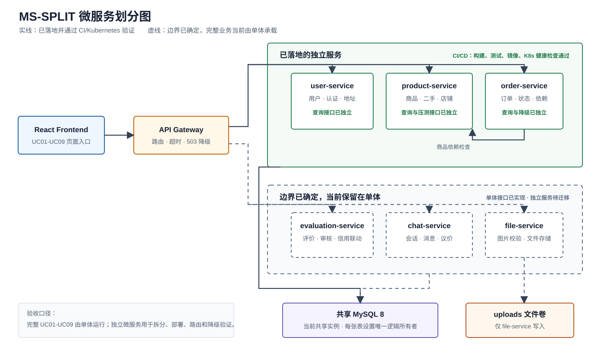

### 2.3 组件清单

| 组件 | 主要职责 | 代码位置 |
| --- | --- | --- |
| React 页面 | 收集输入、呈现状态、组织页面流程 | `frontend/src/pages/` |
| 通用组件 | 地址、商品筛选、评价列表等复用交互 | `frontend/src/components/` |
| Redux 购物车 | 本地购物车归属、合并、库存限制和删除 | `frontend/src/store/cartSlice.js` |
| Axios API Client | 统一 Base URL、JWT 和业务 API | `frontend/src/services/api.js` |
| Express App | 中间件、路由装配、健康检查、错误响应 | `backend/app.js` |
| Auth/Security | JWT、角色保护、限流、CORS、安全头 | `backend/middleware/` |
| Route Modules | 将 URL/HTTP 方法映射到控制器 | `backend/routes/` |
| Controllers | 执行业务校验、状态转换和事务 | `backend/controllers/` |
| Sequelize Models | 映射 8 类持久化对象 | `backend/models/` |
| MySQL | 保存核心业务数据 | `03_devops/docker-compose.yml` 中 `mysql` |
| API Gateway | 转发拆分服务并在上游失败时 503 降级 | `services/api-gateway/` |

## 3. 接口设计

| 领域 | 基础路径 | 主要操作 | 认证 |
| --- | --- | --- | --- |
| 用户 | `/api/users` | 注册、登录、资料、密码 | 注册登录公开，其余 JWT |
| 商品 | `/api/products` | 列表、详情、推荐、本人商品、增改删 | 查询公开，写操作 JWT |
| 二手 | `/api/secondhand` | 二手列表、详情、发布和维护 | 查询公开，写操作 JWT |
| 订单 | `/api/orders` | 创建、列表、支付、取消、发货、确认 | JWT + 买卖角色校验 |
| 店铺 | `/api/shops` | 我的店铺、认证、公开店铺 | 管理 JWT，公开查询无需登录 |
| 评价 | `/api/evaluations` | 创建、三类查询、回复 | 商品评价公开，其余按需 JWT |
| 聊天 | `/api/chats` | 会话、消息、申请处理 | JWT + 会话成员校验 |
| 地址 | `/api/addresses` | 读取和整体替换 | JWT |
| 上传 | `/api/uploads/images` | 图片白名单上传 | JWT |

统一响应约束：失败响应包含 `message`；全局错误响应带 `requestId`；生产环境不向客户端暴露内部异常细节。

## 4. 数据与事务设计

| 数据 | 所有者/模型 | 一致性规则 |
| --- | --- | --- |
| 用户 | `User` | 用户名、邮箱唯一；密码哈希存储 |
| 店铺 | `Shop` | 一个用户至多一个店铺；发布商品前须已认证 |
| 商品 | `Product` | 卖家归属不可由请求篡改；卖家状态采用白名单 |
| 订单 | `Order` | 保存商品和地址快照；创建/取消使用事务同步库存 |
| 评价 | `Evaluation` | 同一订单、商品、买家不可重复；仅完成订单可评价 |
| 地址 | `Address` | 账号隔离；完整字段才保存；默认地址唯一 |
| 会话/消息 | `ChatConversation`, `ChatMessage` | 会话参与者授权；议价申请只能由卖家处理一次 |

购物车仅在浏览器本地存储，使用访客或用户维度的键隔离，不作为 MySQL 实体。

## 5. 组件级业务模型

### 5.1 COMP-SEQ01 注册与登录

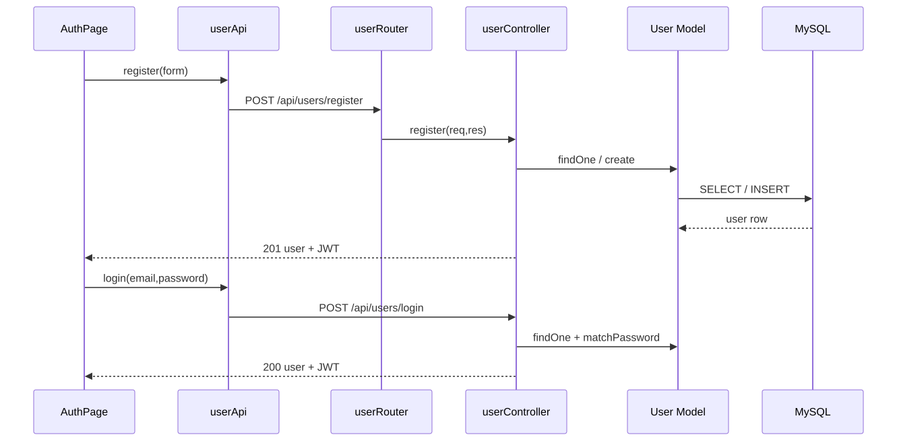

> 可编辑 Mermaid 源文件：[13-COMP-SEQ01.mmd](models/13-COMP-SEQ01.mmd)

### 5.2 COMP-SEQ02 商品检索

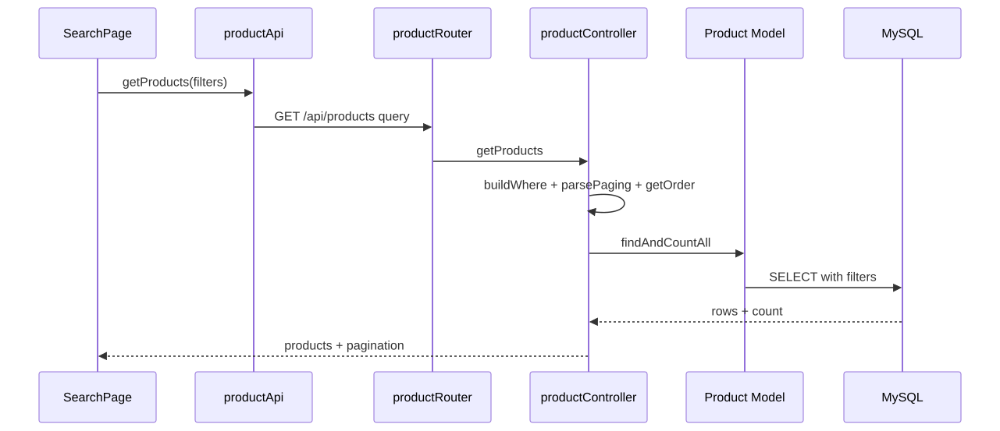

> 可编辑 Mermaid 源文件：[14-COMP-SEQ02.mmd](models/14-COMP-SEQ02.mmd)

### 5.3 COMP-SEQ03 商品详情与购物车

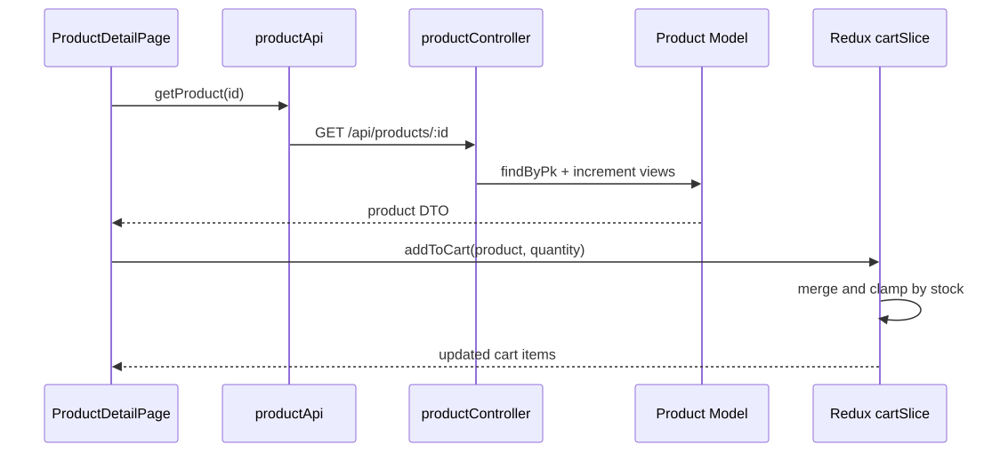

> 可编辑 Mermaid 源文件：[15-COMP-SEQ03.mmd](models/15-COMP-SEQ03.mmd)

### 5.4 COMP-SEQ04 订单交易闭环

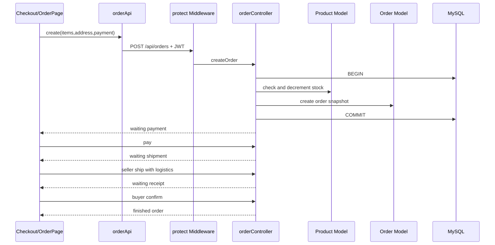

> 可编辑 Mermaid 源文件：[16-COMP-SEQ04.mmd](models/16-COMP-SEQ04.mmd)

### 5.5 COMP-SEQ05 二手商品发布

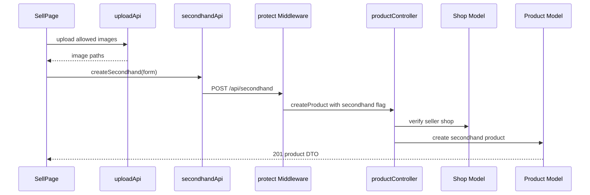

> 可编辑 Mermaid 源文件：[17-COMP-SEQ05.mmd](models/17-COMP-SEQ05.mmd)

### 5.6 COMP-SEQ06 店铺与商品管理

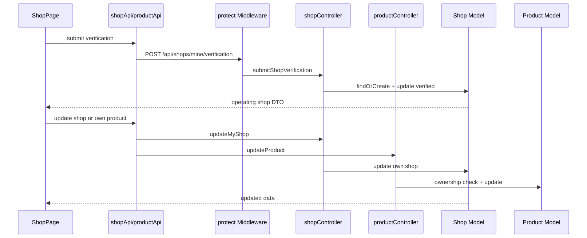

> 可编辑 Mermaid 源文件：[18-COMP-SEQ06.mmd](models/18-COMP-SEQ06.mmd)

### 5.7 COMP-SEQ07 评价与回复

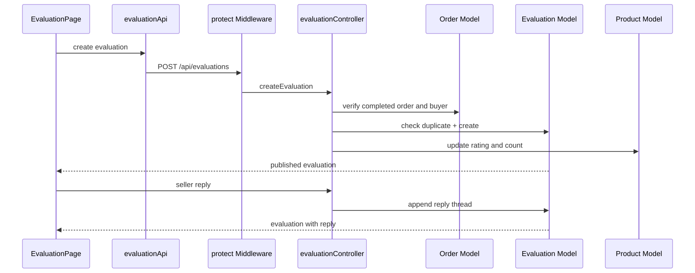

> 可编辑 Mermaid 源文件：[19-COMP-SEQ07.mmd](models/19-COMP-SEQ07.mmd)

### 5.8 COMP-SEQ08 聊天议价

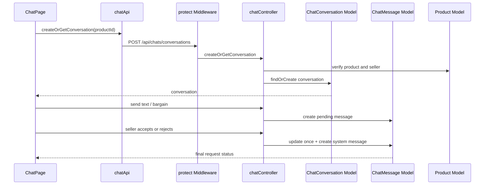

> 可编辑 Mermaid 源文件：[20-COMP-SEQ08.mmd](models/20-COMP-SEQ08.mmd)

成交后的购买由 `ChatPage -> orderController -> ChatMessage/ChatConversation/Order` 完成：订单控制器锁定议价消息，验证成交状态、买家和商品，在订单事务内按议价金额创建订单并写入 `redeemedAt`。

### 5.9 COMP-SEQ09 地址维护

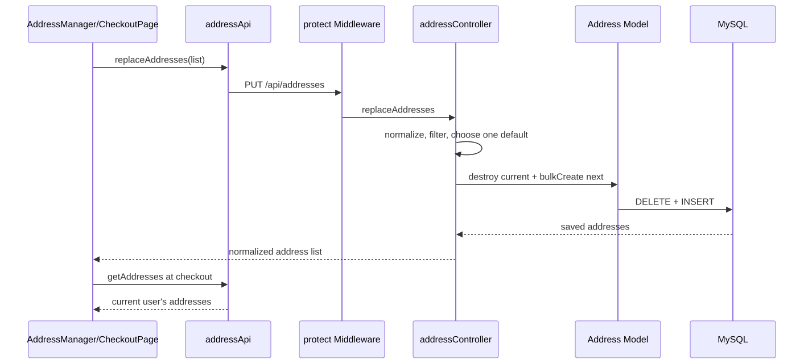

> 可编辑 Mermaid 源文件：[21-COMP-SEQ09.mmd](models/21-COMP-SEQ09.mmd)

## 6. 安全与异常设计

1. `protect` 校验 Bearer JWT，并加载当前用户。
2. 商品、订单、评价和聊天控制器在业务层再次校验资源归属和当前状态。
3. 注册参数、分页、地址、物流、议价金额、上传 MIME 类型采用白名单或规范化。
4. 创建/取消订单使用 Sequelize transaction；中途失败回滚订单与库存。
5. 全局安全中间件提供限流、安全响应头、CORS、请求编号和生产密钥检查。
6. API Gateway 捕获上游不可用并返回 503，不伪造成功结果。

## 7. 运行与部署设计

| 环境 | 组合 | 健康判定 |
| --- | --- | --- |
| 本地单体 | Frontend + Backend + MySQL Docker Compose | `/api/health` 返回应用和数据库 `ok` |
| 微服务实验 | Gateway + User + Product + Order | 各服务 `/health`，网关真实转发和降级测试 |
| Kubernetes | 单体及微服务 manifests | Deployment rollout + Pod 内 HTTP 健康检查 |
| CI/CD | GitHub Actions | 四类测试均成功后才允许镜像和部署阶段 |

## 8. 设计约束

- UC01-UC09 的完整业务验收以单体 API 为准，微服务目录用于课程拆分和部署对比，不虚构未迁移业务。
- 商品图片保存在本地上传目录，生产化 OSS 不在当前范围。
- 支付只改变站内订单状态，不对接资金系统；物流由卖家录入。
- 店铺认证为资料完整后的演示认证，不代表人工审核。
