# 软件详细设计说明书

## 1. 文档目的

本文把概要组件落实到当前仓库中的页面、API 方法、控制器函数、Sequelize 模型和关键业务规则，并给出 UC01-UC09 的对象级顺序图。名称均对应真实代码，可直接从图追溯到实现和测试。

## 2. 代码结构

```text
frontend/src/
  pages/                 页面级业务入口
  components/            地址、商品、评价等复用组件
  services/api.js        Axios 实例和领域 API 对象
  store/cartSlice.js     购物车 Redux reducer
backend/
  app.js                 Express 装配、健康检查和全局错误处理
  middleware/            JWT、安全头、限流和 CORS
  routes/                URL 与控制器函数映射
  controllers/           业务规则、权限和状态转换
  models/                Sequelize 模型
  utils/                 信用规则和建表兼容逻辑
services/
  api-gateway/           HTTP 转发和 503 降级
  user-service/          用户服务拆分样例
  product-service/       商品服务拆分样例
  order-service/         订单服务拆分样例
```

## 3. 实现类图

### 3.1 DESIGN-CLASS 类图

**图 DESIGN-CLASS：实现类图。最终 PDF 应在本节保留该图。**

```mermaid
classDiagram
  class AuthPage { +submitRegister(); +submitLogin() }
  class SearchPage { +loadProducts(filters) }
  class ProductDetailPage { +loadProduct(id); +handleAddToCart() }
  class CheckoutPage { +submitOrder() }
  class ShopPage { +submitVerification(); +saveShop() }
  class EvaluationPage { +submitEvaluation() }
  class ChatPage { +sendText(); +sendBargain(); +decideRequest() }
  class AddressManager { +loadAddresses(); +saveAddresses() }
  class ApiClient { +request(config); +attachJwt() }
  class CartSlice { +addToCart(); +updateQuantity(); +removeFromCart(); +clearCart() }
  class UserController { +register(); +login(); +getUserProfile(); +updatePassword() }
  class ProductController { +getProducts(); +getProductDetail(); +createProduct(); +updateProduct() }
  class OrderController { +createOrder(); +cancelOrder(); +payOrder(); +shipOrder(); +confirmOrder() }
  class ShopController { +getMyShop(); +submitShopVerification(); +updateMyShop() }
  class EvaluationController { +createEvaluation(); +replyEvaluation() }
  class ChatController { +createOrGetConversation(); +sendMessage(); +decideRequest() }
  class AddressController { +getAddresses(); +replaceAddresses() }
  class User { +id; +email; +password; +creditScore; +matchPassword() }
  class Product { +id; +sellerId; +price; +stock; +status; +isSecondhand }
  class Order { +id; +userId; +items; +status; +paymentStatus; +logisticsInfo }
  class Shop { +id; +userId; +verificationStatus; +status }
  class Evaluation { +id; +orderId; +productId; +rating; +reply }
  class Address { +id; +userId; +name; +phone; +isDefault }
  class ChatConversation { +id; +buyerId; +sellerId; +productId }
  class ChatMessage { +id; +conversationId; +type; +amount; +requestStatus }
  AuthPage --> ApiClient
  SearchPage --> ApiClient
  ProductDetailPage --> ApiClient
  ProductDetailPage --> CartSlice
  CheckoutPage --> ApiClient
  ShopPage --> ApiClient
  EvaluationPage --> ApiClient
  ChatPage --> ApiClient
  AddressManager --> ApiClient
  ApiClient --> UserController
  ApiClient --> ProductController
  ApiClient --> OrderController
  ApiClient --> ShopController
  ApiClient --> EvaluationController
  ApiClient --> ChatController
  ApiClient --> AddressController
  UserController --> User
  ProductController --> Product
  ProductController --> Shop
  OrderController --> Order
  OrderController --> Product
  ShopController --> Shop
  EvaluationController --> Evaluation
  EvaluationController --> Order
  ChatController --> ChatConversation
  ChatController --> ChatMessage
  AddressController --> Address
  User "1" <-- "0..1" Shop
  User "1" <-- "0..*" Product
  User "1" <-- "0..*" Order
  User "1" <-- "0..*" Address
  Order "1" <-- "0..*" Evaluation
  Product "1" <-- "0..*" Evaluation
  ChatConversation "1" <-- "0..*" ChatMessage
```

## 4. 前端对象设计

| 对象 | 状态/输入 | 关键行为 |
| --- | --- | --- |
| `AuthPage` | mode、表单、loading | 调用 `userApi.register/login`，保存 token 和 user |
| `SearchPage` | keyword、filters、sort、pagination | 调用 `productApi.getList` 并渲染结果 |
| `ProductDetailPage` | product、quantity | 查询详情，向 `cartSlice` 分发 `addToCart` |
| `cartSlice` | items、storageKey | 按用户隔离；合并同商品；数量按库存截断 |
| `CheckoutPage` | cart items、addresses、payment | 读取地址，创建订单，成功后清空购物车 |
| `ShopPage` | shop、verification form | 上传图片、提交认证、编辑店铺 |
| `EvaluationPage` | order、ratings、contents | 仅针对订单商品逐项提交评价 |
| `ChatPage` | conversation、messages、amount | 文本、议价及卖家处理 |
| `AddressManager` | address list、editing item | 整体替换保存，保证默认项交互一致 |

`frontend/src/services/api.js` 的请求拦截器从 `localStorage` 读取 token，统一添加 `Authorization: Bearer <token>`。超时默认 3000ms，上传为 15000ms。

## 5. 后端对象与规则设计

| 控制器 | 关键函数 | 主要规则 |
| --- | --- | --- |
| `userController` | `register`, `login`, `updatePassword` | 邮箱格式、密码长度、唯一性、bcrypt、JWT |
| `productController` | `buildWhere`, `getProducts`, `createProduct`, `updateProduct` | 分页 1-100、在售默认、店铺认证、卖家归属、状态白名单 |
| `orderController` | `createOrder`, `cancelOrder`, `payOrder`, `shipOrder`, `confirmOrder` | 事务库存、角色权限、状态机、完整物流 |
| `shopController` | `getOrCreateShop`, `submitShopVerification`, `updateMyShop` | 一用户一店铺、认证必填字段、本人管理 |
| `evaluationController` | `createEvaluation`, `replyEvaluation`, `updateProductRating` | 完成订单、买家归属、商品关系、不可重复、回复线程 |
| `chatController` | `createOrGetConversation`, `sendMessage`, `decideRequest` | 禁止自聊、成员权限、金额有效、卖家一次性处理 |
| `addressController` | `normalizeInput`, `replaceAddresses` | 过滤不完整地址、唯一默认、账号隔离 |

## 6. 数据模型细节

| 模型 | 主键和关键字段 | 关联 |
| --- | --- | --- |
| `User` | `id`, `username`, `email`, `password`, `role`, `creditScore` | 店铺、商品、订单、地址、评价和会话参与者 |
| `Shop` | `id`, `userId`, `verificationStatus`, `status` | `belongsTo(User)` |
| `Product` | `id`, `sellerId`, `price`, `stock`, `status`, `isSecondhand` | `belongsTo(User)` |
| `Order` | `id`, `userId`, JSON `items`, `shippingAddress`, `logisticsInfo` | `belongsTo(User)`；商品采用下单快照 |
| `Evaluation` | `id`, `orderId`, `userId`, `productId`, `sellerId` | 属于订单、商品、买家和卖家 |
| `Address` | string `id`, `userId`, `isDefault` | `belongsTo(User)` |
| `ChatConversation` | `id`, `buyerId`, `sellerId`, `productId` | 属于买家、卖家和商品 |
| `ChatMessage` | `id`, `conversationId`, `senderId`, `requestStatus` | 属于会话和发送者 |

订单的 `items`、`shippingAddress`、`logisticsInfo` 使用 JSON 保存业务快照，避免商品或地址后续编辑改变历史订单。

## 7. 对象级业务模型

### 7.1 OBJ-SEQ01 注册与登录对象调用

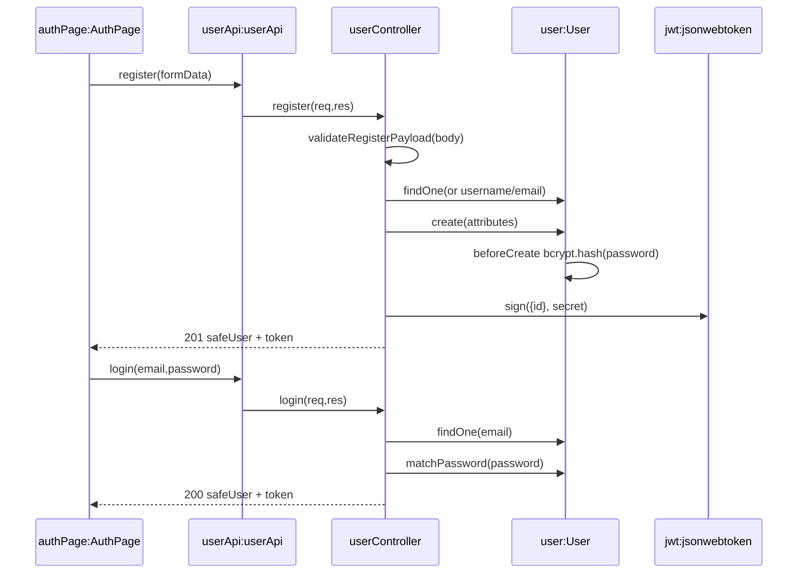

### 7.2 OBJ-SEQ02 商品检索对象调用

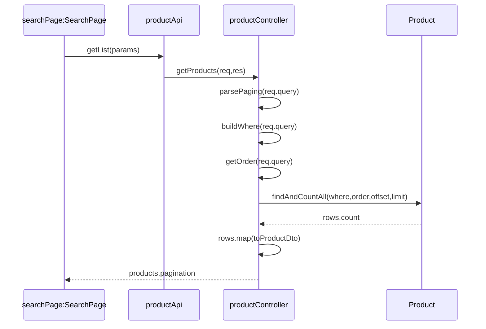

### 7.3 OBJ-SEQ03 详情与购物车对象调用

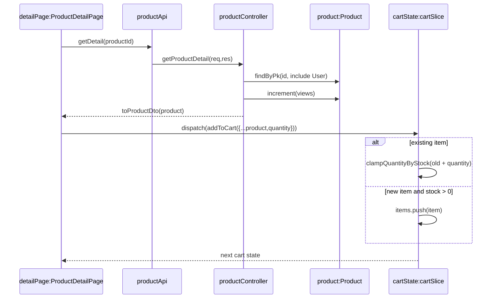

### 7.4 OBJ-SEQ04 订单状态与事务对象调用

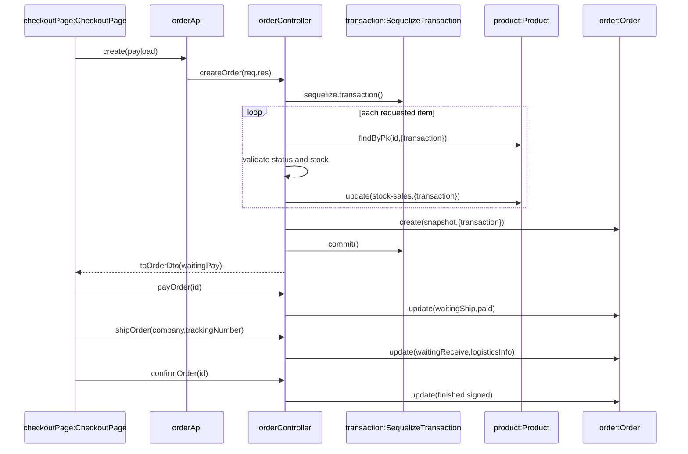

### 7.5 OBJ-SEQ05 二手发布对象调用

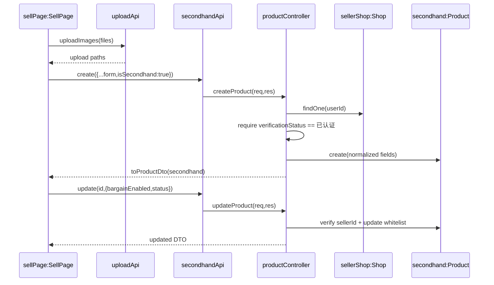

### 7.6 OBJ-SEQ06 店铺认证对象调用

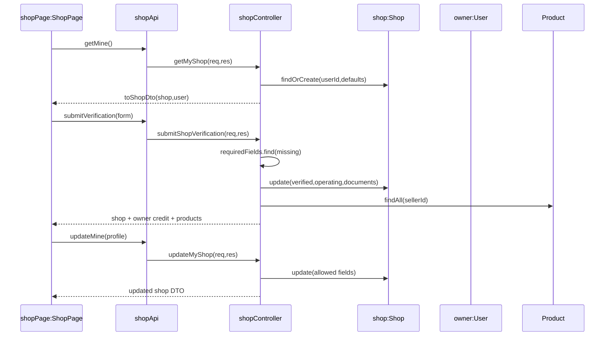

### 7.7 OBJ-SEQ07 评价与回复对象调用

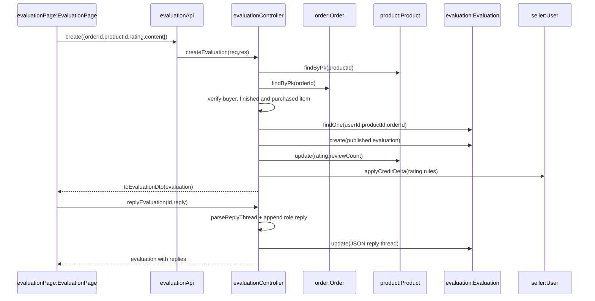

### 7.8 OBJ-SEQ08 聊天议价对象调用

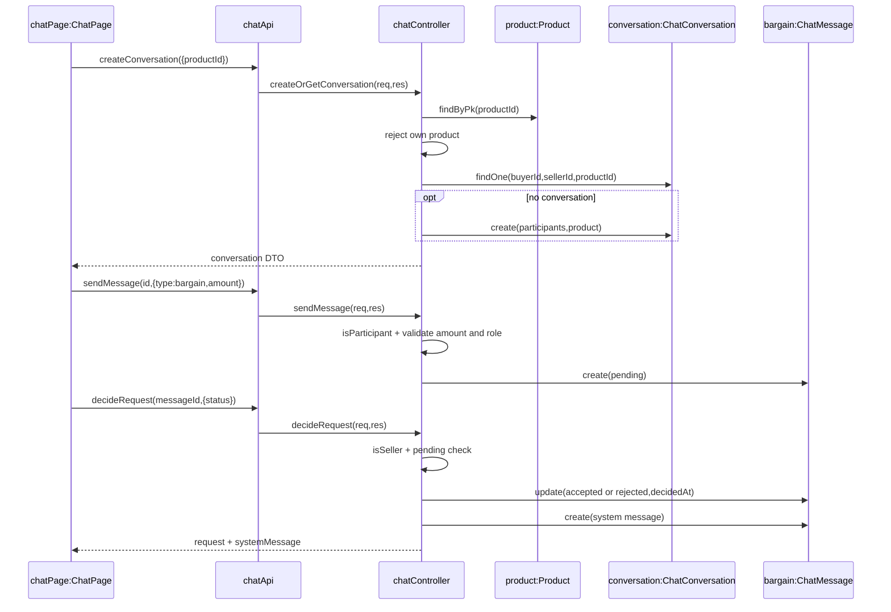

### 7.9 OBJ-SEQ09 地址维护对象调用

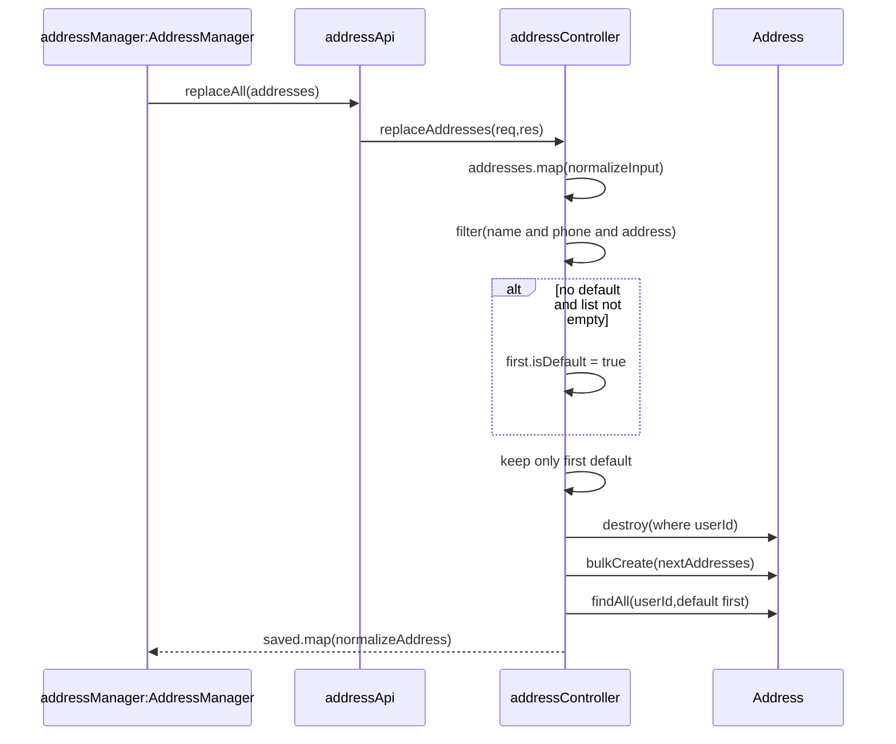

## 8. 订单状态机

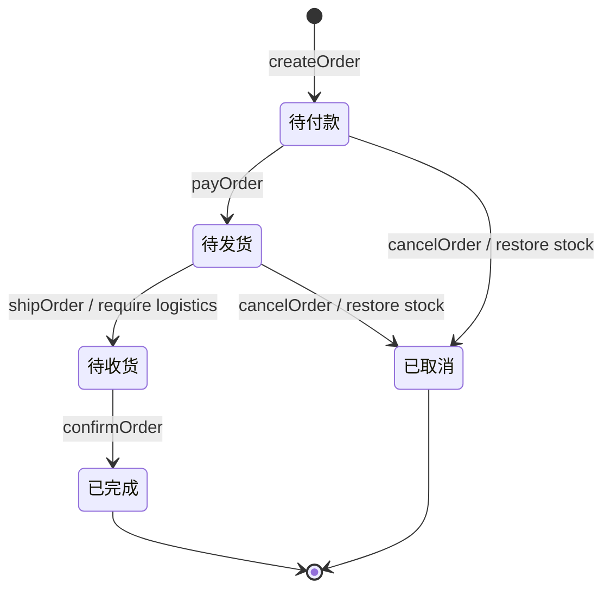

订单状态机是详细设计辅助图，不替代 `OBJ-SEQ04`，也不计入课程最低 31 张图。

## 9. 异常和返回设计

| 状态码 | 使用场景 |
| --- | --- |
| 200/201 | 查询或更新成功/资源创建成功 |
| 400 | 参数、业务状态、库存、重复评价、非法议价等错误 |
| 401 | 缺少或无效 JWT、错误登录凭证 |
| 403 | 已登录但无资源权限或店铺未认证 |
| 404 | 商品、订单、店铺、评价或会话不存在 |
| 429 | 超过限流阈值 |
| 500 | 未预期内部错误，生产环境隐藏内部细节 |
| 503 | 数据库未就绪、健康检查降级或微服务上游不可用 |

## 10. 测试对应

- 规则函数由 `backend/tests/businessRules.test.js`、`security.test.js`、`creditRules.test.js` 和前端 `cartSlice.test.js` 覆盖。
- 对象协作与真实数据库由 `INT-TC01-MAIN/ALT/ERR` 至 `INT-TC09-MAIN/ALT/ERR` 覆盖。
- 页面入口由 `E2E-TC01` 至 `E2E-TC09` 覆盖，测试实现位于 `frontend/e2e/customer-flow.spec.js`。
