# 软件详细设计说明书

## 1. 文档目的

本文把概要组件落实到当前仓库中的页面、API 方法、控制器函数、Sequelize 模型和关键业务规则，并给出 UC01-UC12 的对象级顺序图。名称均对应真实代码，可直接从图追溯到实现和测试。

## 2. 代码结构

```text
frontend/src/
  pages/                 页面级业务入口
  components/            地址、商品、评价等复用组件
  services/api.js        Axios 实例和领域 API 对象
  store/cartSlice.js     购物车 Redux reducer
backend/
  app.js                 Express 装配、健康检查和全局错误处理
  middleware/            JWT、安全头、限流和 CORS
  routes/                URL 与控制器函数映射
  controllers/           业务规则、权限和状态转换
  models/                Sequelize 模型
  utils/                 信用规则和建表兼容逻辑
services/
  api-gateway/           HTTP 转发和 503 降级
  user-service/          用户服务拆分样例
  product-service/       商品服务拆分样例
  order-service/         订单服务拆分样例
```

## 3. 实现类图

### 3.1 DESIGN-CLASS 类图

**图 DESIGN-CLASS：实现类图。最终 PDF 应在本节保留该图。**


> 可编辑 Mermaid 源文件：[22-DESIGN-CLASS.mmd](models/22-DESIGN-CLASS.mmd)

## 4. 前端对象设计

| 对象 | 状态/输入 | 关键行为 |
| --- | --- | --- |
| `AuthPage` | mode、表单、loading | 调用 `userApi.register/login`，保存 token 和 user |
| `SearchPage` | keyword、filters、sort、pagination | 调用 `productApi.getList` 并渲染结果 |
| `ProductDetailPage` | product、quantity | 查询详情，向 `cartSlice` 分发 `addToCart` |
| `cartSlice` | items、storageKey | 按用户隔离；合并同商品；数量按库存截断 |
| `CheckoutPage` | cart/bargain item、addresses、payment | 读取地址；普通购物车下单，或携带议价消息编号提交专属订单 |
| `ShopPage` | shop、verification form | 上传图片、提交认证、编辑店铺 |
| `EvaluationPage` | order、ratings、contents、已有评价 | 加载订单后再渲染表单；已评价商品只读展示原文、星级和回复，未评价项才可提交 |
| `ChatPage` | conversation、messages、amount | 文本、议价及卖家处理 |
| `AddressManager` | address list、editing item | 整体替换保存，保证默认项交互一致 |
| `OrderPage` | orders、loading、error | 查询本人订单，展示物流，执行取消/支付/确认收货 |
| `PublicShopPage` | shop、products、credit | 按卖家加载公开店铺、信用和在售商品 |

`frontend/src/services/api.js` 的请求拦截器从 `localStorage` 读取 token，统一添加 `Authorization: Bearer <token>`。超时默认 3000ms，上传为 15000ms。

## 5. 后端对象与规则设计

| 控制器 | 关键函数 | 主要规则 |
| --- | --- | --- |
| `userController` | `register`, `login`, `updatePassword` | 邮箱格式、密码长度、唯一性、bcrypt、JWT |
| `productController` | `buildWhere`, `getProducts`, `createProduct`, `updateProduct` | 分页 1-100、在售默认、店铺认证、卖家归属、状态白名单 |
| `orderController` | `createOrder`, `cancelOrder`, `payOrder`, `shipOrder`, `confirmOrder` | 事务库存、议价买家/商品/状态校验、一次性核销、角色权限、状态机、完整物流 |
| `shopController` | `getOrCreateShop`, `submitShopVerification`, `updateMyShop` | 一用户一店铺、认证必填字段、本人管理 |
| `evaluationController` | `createEvaluation`, `replyEvaluation`, `updateProductRating` | 完成订单、买家归属、商品关系、不可重复、回复线程 |
| `chatController` | `createOrGetConversation`, `sendMessage`, `decideRequest` | 禁止自聊、成员权限、金额有效、卖家一次性处理 |
| `addressController` | `normalizeInput`, `replaceAddresses` | 过滤不完整地址、唯一默认、账号隔离 |

## 6. 数据模型细节

| 模型 | 主键和关键字段 | 关联 |
| --- | --- | --- |
| `User` | `id`, `username`, `email`, `password`, `role`, `creditScore` | 店铺、商品、订单、地址、评价和会话参与者 |
| `Shop` | `id`, `userId`, `verificationStatus`, `status` | `belongsTo(User)` |
| `Product` | `id`, `sellerId`, `price`, `stock`, `status`, `isSecondhand` | `belongsTo(User)` |
| `Order` | `id`, `userId`, JSON `items`, `shippingAddress`, `logisticsInfo` | `belongsTo(User)`；商品采用下单快照 |
| `Evaluation` | `id`, `orderId`, `userId`, `productId`, `sellerId` | 属于订单、商品、买家和卖家 |
| `Address` | string `id`, `userId`, `isDefault` | `belongsTo(User)` |
| `ChatConversation` | `id`, `buyerId`, `sellerId`, `productId` | 属于买家、卖家和商品 |
| `ChatMessage` | `id`, `conversationId`, `senderId`, `requestStatus`, `redeemedAt` | 属于会话和发送者；成功议价下单后记录核销时间 |

订单的 `items`、`shippingAddress`、`logisticsInfo` 使用 JSON 保存业务快照，避免商品或地址后续编辑改变历史订单。

## 7. 对象级业务模型

### 7.1 OBJ-SEQ01 注册与登录对象调用

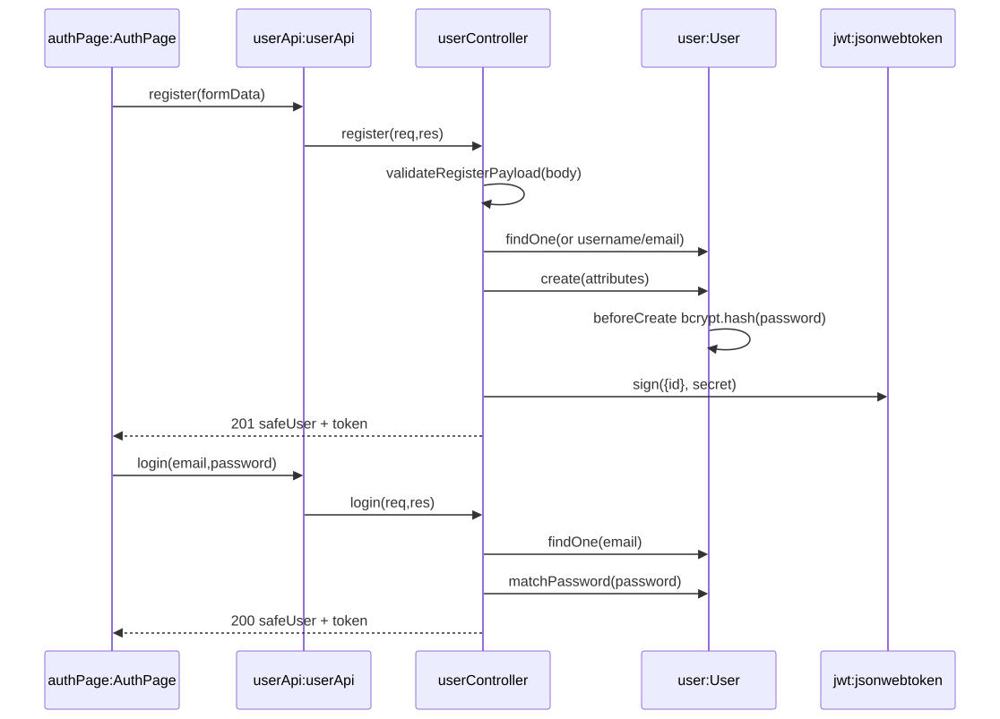

> 可编辑 Mermaid 源文件：[23-OBJ-SEQ01.mmd](models/23-OBJ-SEQ01.mmd)

### 7.2 OBJ-SEQ02 商品检索对象调用

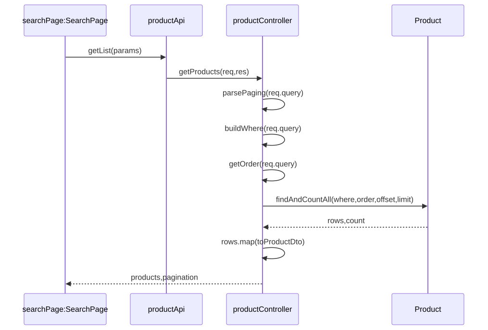

> 可编辑 Mermaid 源文件：[24-OBJ-SEQ02.mmd](models/24-OBJ-SEQ02.mmd)

### 7.3 OBJ-SEQ03 详情与购物车对象调用

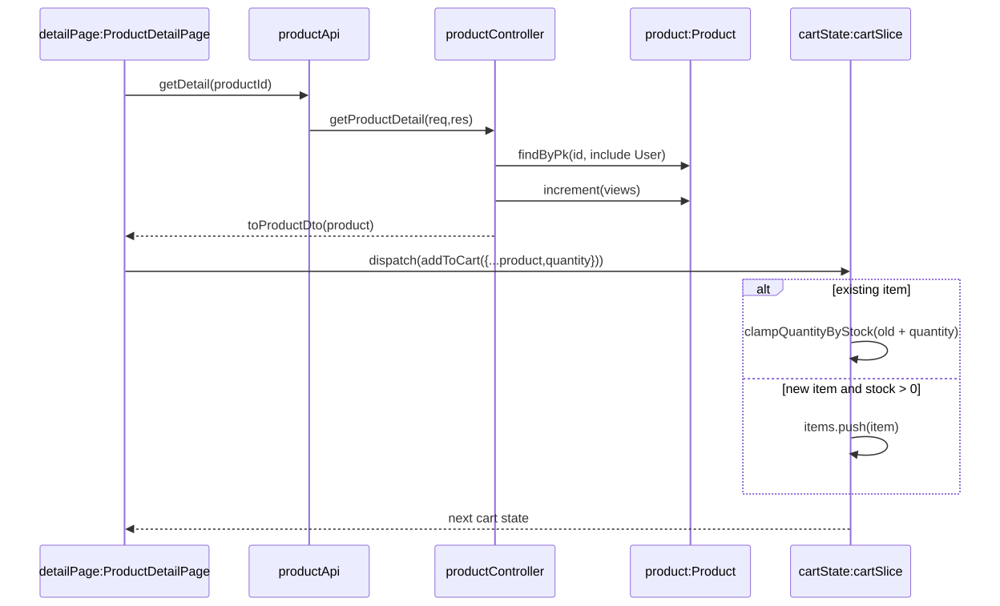

> 可编辑 Mermaid 源文件：[25-OBJ-SEQ03.mmd](models/25-OBJ-SEQ03.mmd)

### 7.4 OBJ-SEQ04 订单状态与事务对象调用

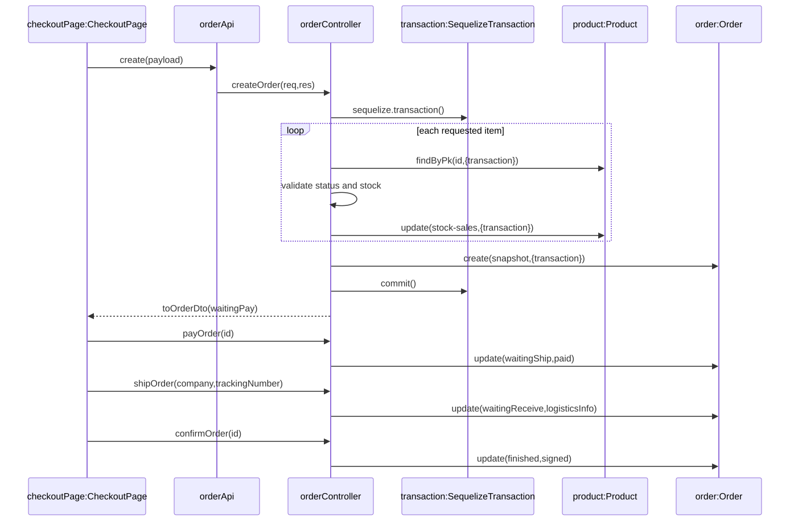

> 可编辑 Mermaid 源文件：[26-OBJ-SEQ04.mmd](models/26-OBJ-SEQ04.mmd)

### 7.5 OBJ-SEQ05 二手发布对象调用

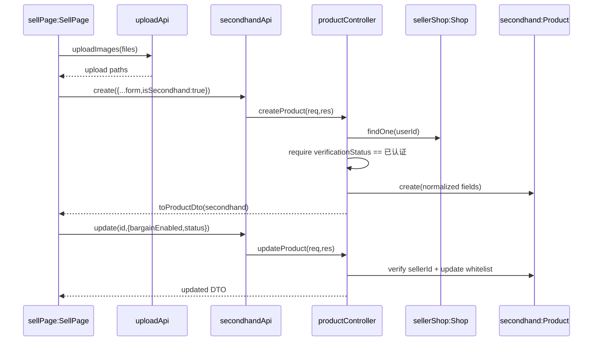

> 可编辑 Mermaid 源文件：[27-OBJ-SEQ05.mmd](models/27-OBJ-SEQ05.mmd)

### 7.6 OBJ-SEQ06 店铺认证对象调用

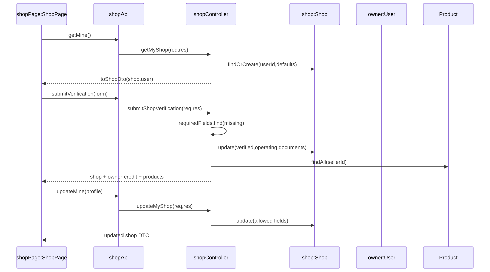

> 可编辑 Mermaid 源文件：[28-OBJ-SEQ06.mmd](models/28-OBJ-SEQ06.mmd)

### 7.7 OBJ-SEQ07 评价与回复对象调用

评价页先请求订单与当前用户评价历史，再渲染表单；已评价商品展示原文、星级和回复，不可重复提交。顺序图仍描述创建评价与回复的对象调用。

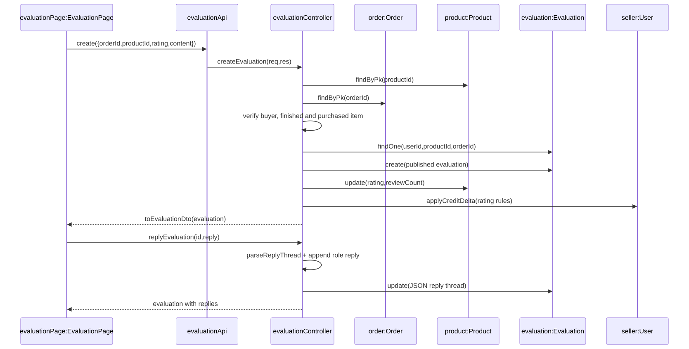

> 可编辑 Mermaid 源文件：[29-OBJ-SEQ07.mmd](models/29-OBJ-SEQ07.mmd)

### 7.8 OBJ-SEQ08 聊天议价对象调用

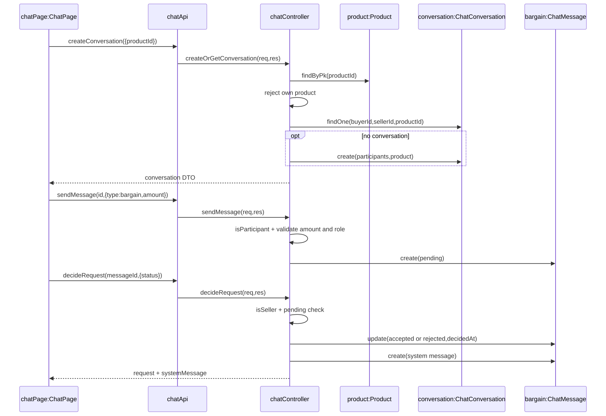

> 可编辑 Mermaid 源文件：[30-OBJ-SEQ08.mmd](models/30-OBJ-SEQ08.mmd)

补充对象调用：`ChatPage` 将 `productId`、`bargainMessageId` 和固定数量 1 交给 `orderController.createOrder`；控制器锁定 `ChatMessage`，通过 `ChatConversation` 校验买家、商品和卖家，按 `message.amount` 创建 `Order`，并在同一事务中更新 `redeemedAt`。

### 7.9 OBJ-SEQ09 地址维护对象调用

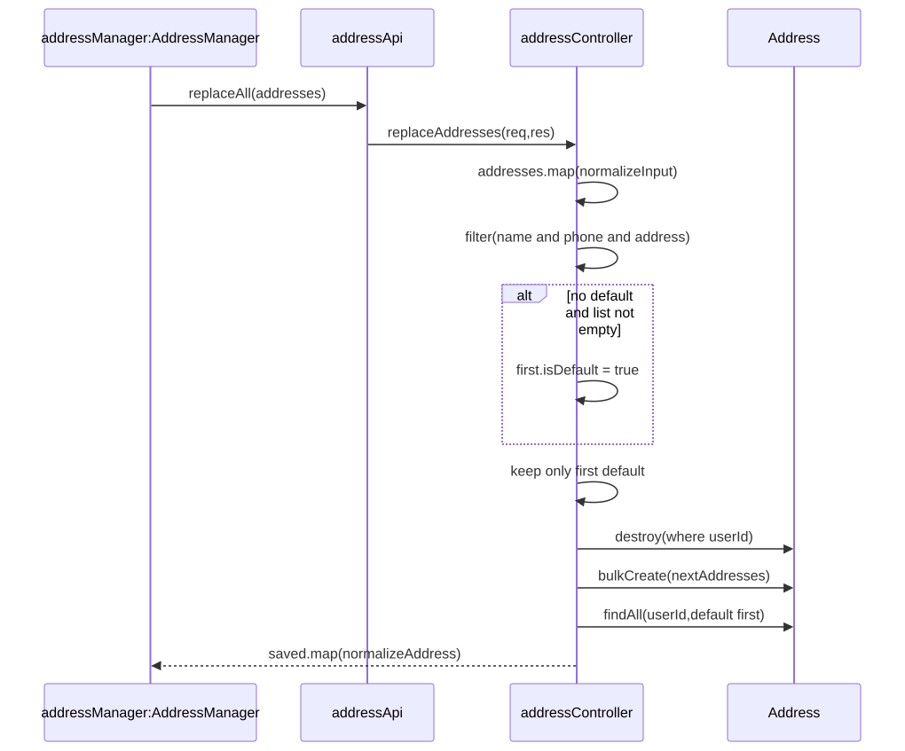

> 可编辑 Mermaid 源文件：[31-OBJ-SEQ09.mmd](models/31-OBJ-SEQ09.mmd)

### 7.10 OBJ-SEQ10 订单与物流查询对象调用

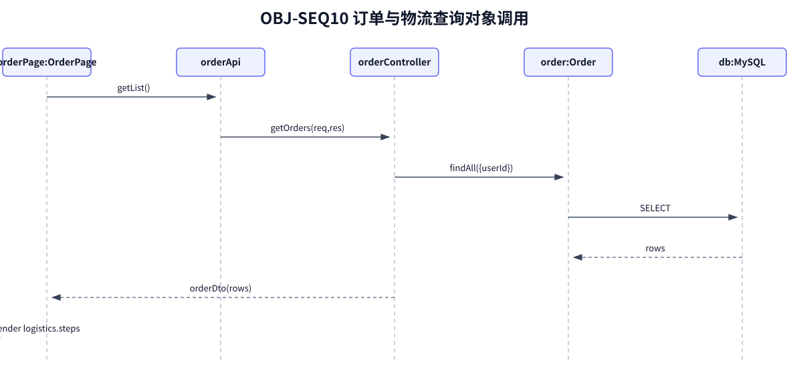

> 可编辑 Mermaid 源文件：[40-OBJ-SEQ10.mmd](models/40-OBJ-SEQ10.mmd)

### 7.11 OBJ-SEQ11 取消订单事务对象调用

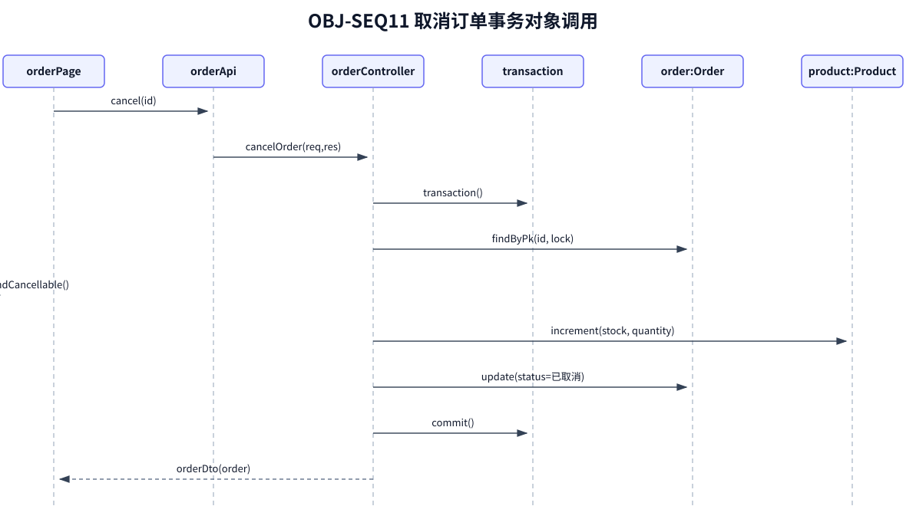

> 可编辑 Mermaid 源文件：[41-OBJ-SEQ11.mmd](models/41-OBJ-SEQ11.mmd)

### 7.12 OBJ-SEQ12 公开店铺对象调用

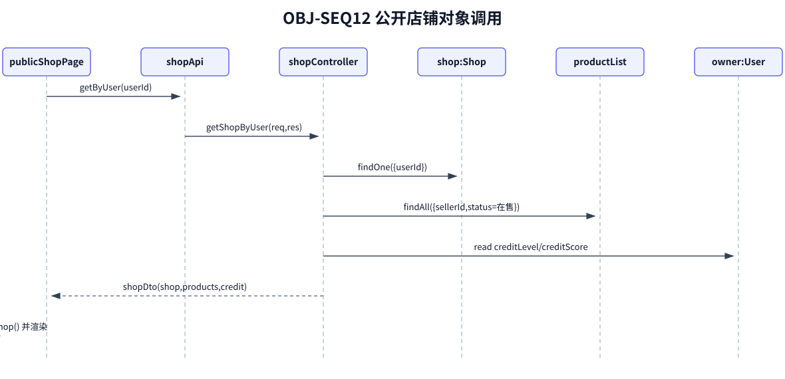

> 可编辑 Mermaid 源文件：[42-OBJ-SEQ12.mmd](models/42-OBJ-SEQ12.mmd)

## 8. 订单状态机


> 可编辑 Mermaid 源文件：[32-ORDER-STATE.mmd](models/32-ORDER-STATE.mmd)

订单状态机是详细设计辅助图，不替代 `OBJ-SEQ04`，也不计入 UC01-UC12 对应的 40 张必需图。

## 9. 异常和返回设计

| 状态码 | 使用场景 |
| --- | --- |
| 200/201 | 查询或更新成功/资源创建成功 |
| 400 | 参数、业务状态、库存、重复评价、非法议价等错误 |
| 401 | 缺少或无效 JWT、错误登录凭证 |
| 403 | 已登录但无资源权限或店铺未认证 |
| 404 | 商品、订单、店铺、评价或会话不存在 |
| 429 | 超过限流阈值 |
| 500 | 未预期内部错误，生产环境隐藏内部细节 |
| 503 | 数据库未就绪、健康检查降级或微服务上游不可用 |

## 10. 测试对应

- 规则函数和页面组件由 `UNIT-TC01` 至 `UNIT-TC12` 覆盖，实现位于后端规则/控制器测试及前端 `orderPublicShop.test.jsx` 等测试文件。
- 对象协作与真实数据库由 `INT-TC01-MAIN/ALT/ERR` 至 `INT-TC09-MAIN/ALT/ERR` 以及 `INT-PUBLIC-02` 覆盖；UC10-UC12 复用对应订单、取消和公开店铺接口的既有断言。
- 页面入口由 `E2E-TC01` 至 `E2E-TC12` 的主流程、备选/异常流程和组合流程覆盖，测试实现位于 `frontend/e2e/customer-flow.spec.js` 与 `frontend/e2e/customer-flow-alt-error.spec.js`，共 42 项。
