# 软件需求规格说明书

## 1. 文档信息

| 项目 | 内容 |
| --- | --- |
| 系统名称 | 购物与二手交易平台 |
| 课程 | 软件工程基础实践（2026 夏） |
| 需求基线 | `monolith-start`，提交 `44cfabf` |
| 验收范围 | REQ01-REQ09 / UC01-UC09 |
| 实现边界 | React + Express + Sequelize + MySQL；支付、物流和店铺认证为站内演示流程 |
| 配套材料 | `02_docs/第1天业务场景清单与确认表.md`、`业务场景用例清单与追溯表.md` |

## 2. 项目范围

系统为买家和卖家提供注册登录、商品检索、购物车、订单交易、二手发布、店铺管理、评价、聊天议价和地址维护。系统目标是让 UC01-UC09 都从用户触发开始，以可查询、可断言的业务结果结束。

以下内容不属于本次验收：短信或邮箱验证码、第三方登录、真实支付回调、外部物流轨迹、人工认证审核、纠纷工单、Elasticsearch、Redis、消息队列和 OSS 视频。详细排除记录见第1天确认表 EX01-EX09。

## 3. 用户与外部参与者

| 参与者 | 职责 |
| --- | --- |
| 游客 | 注册、登录、浏览和搜索商品 |
| 买家 | 维护购物车和地址、下单支付、确认收货、评价、聊天议价 |
| 卖家 | 认证店铺、发布和管理商品、发货、回复评价、处理议价 |
| MySQL | 持久化用户、商品、订单、评价、店铺、地址和聊天数据 |
| CI/CD 平台 | 自动执行测试、构建镜像和部署检查，不属于业务用例参与者 |

## 4. 需求与用户故事

| 需求 | 用户故事 | 验收结果 | 用例 |
| --- | --- | --- | --- |
| REQ01 | 作为游客，我希望注册并登录，以使用受保护功能 | 获得 JWT，资料可访问且不返回密码 | UC01 |
| REQ02 | 作为用户，我希望按关键词、分类、价格和排序查找商品 | 返回满足条件的分页结果 | UC02 |
| REQ03 | 作为买家，我希望查看详情并加购，以准备结算 | 购物车商品、数量和金额正确 | UC03 |
| REQ04 | 作为买家和卖家，我希望完成下单到收货的交易闭环 | 订单已完成，支付、物流和库存正确 | UC04 |
| REQ05 | 作为卖家，我希望发布二手商品，以供其他用户交易 | 二手详情和列表可访问 | UC05 |
| REQ06 | 作为卖家，我希望认证和维护店铺及商品 | 店铺营业，资料及本人商品变更生效 | UC06 |
| REQ07 | 作为买家，我希望评价已完成订单，卖家可以回复 | 评价和回复可查询且不可重复评价 | UC07 |
| REQ08 | 作为买卖双方，我希望咨询并议价 | 消息有序保存，申请得到同意或拒绝 | UC08 |
| REQ09 | 作为买家，我希望维护收货地址并用于结算 | 地址持久化、默认唯一、账号隔离 | UC09 |

## 5. 总用例图

**图 REQ-USECASE：系统总用例图。最终 PDF 应在本节保留该图。**

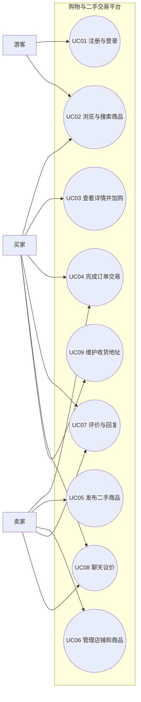

## 6. 概念类图

**图 REQ-DOMAIN：领域概念类图。只表达业务概念，不表达 Controller 等实现类。**

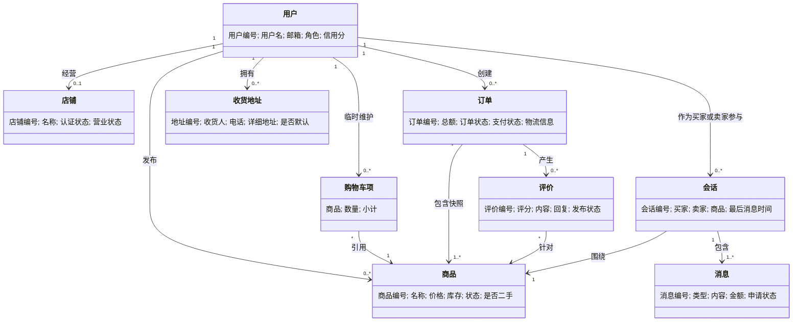

## 7. 用例说明

### UC01 注册并登录平台

| 项目 | 内容 |
| --- | --- |
| 参与者/触发 | 游客希望使用受保护功能 |
| 前置条件 | 用户未登录；注册邮箱和用户名未占用 |
| 主成功流程 | 填写注册信息；系统校验并加密密码；创建用户并返回 JWT；用户再次登录并访问资料 |
| 备选流程 | 已注册用户直接登录；登录后更新昵称、手机号或密码 |
| 异常流程 | 缺字段、邮箱错误、弱密码、重复用户、错误密码或无效令牌时拒绝 |
| 可验证结果 | JWT 有效；资料接口返回当前用户；响应不含密码 |

### UC02 浏览并搜索商品

| 项目 | 内容 |
| --- | --- |
| 参与者/触发 | 游客或买家输入关键词或筛选条件 |
| 前置条件 | 后端和数据库可访问 |
| 主成功流程 | 输入关键词、分类、价格或排序；系统查询在售商品；返回分页列表 |
| 备选流程 | 浏览全部商品；切换二手专区；无匹配时返回空列表 |
| 异常流程 | 非法分页被归一化；数据库失败时返回错误而非伪造结果 |
| 可验证结果 | 结果满足筛选条件，默认不包含不可售商品 |

### UC03 查看详情并加入购物车

| 项目 | 内容 |
| --- | --- |
| 参与者/触发 | 买家从列表选择商品 |
| 前置条件 | 商品存在且可访问 |
| 主成功流程 | 查看详情；选择数量；加入购物车；查看正确小计和总额 |
| 备选流程 | 相同商品合并数量；购物车中增减或删除商品 |
| 异常流程 | 商品不存在、零库存或数量超库存时不形成有效结算项 |
| 可验证结果 | 详情与后端一致；购物车数量不超过库存 |

### UC04 完成订单交易

| 项目 | 内容 |
| --- | --- |
| 参与者/触发 | 买家提交结算，卖家继续履约 |
| 前置条件 | 已登录；商品在售且库存充足；地址有效 |
| 主成功流程 | 创建待付款订单并扣库存；支付；卖家填写物流并发货；买家确认收货 |
| 备选流程 | 待付款或待发货阶段取消订单并恢复库存 |
| 异常流程 | 商品不存在、库存不足、越权、物流缺失或重复状态操作时拒绝 |
| 可验证结果 | 状态依次为待付款、待发货、待收货、已完成，库存和物流可查询 |

### UC05 发布二手商品

| 项目 | 内容 |
| --- | --- |
| 参与者/触发 | 已认证卖家提交二手商品信息 |
| 前置条件 | 已登录且店铺已认证 |
| 主成功流程 | 填写商品、成色、地点等信息；校验；创建二手在售商品；进入详情 |
| 备选流程 | 开关议价；编辑资料；上下架 |
| 异常流程 | 未认证、非法状态、非本人修改或非法文件类型时拒绝 |
| 可验证结果 | 商品带二手标识、成色、地点和正确卖家归属 |

### UC06 管理店铺和商品

| 项目 | 内容 |
| --- | --- |
| 参与者/触发 | 卖家进入店铺中心 |
| 前置条件 | 用户已登录 |
| 主成功流程 | 填写认证资料；店铺进入营业中；编辑店铺；维护本人商品 |
| 备选流程 | 已认证用户直接管理；游客查看公开店铺 |
| 异常流程 | 资料缺失、未认证发布、修改他人商品或非法状态时拒绝 |
| 可验证结果 | 店铺状态和资料可查询，商品变更只作用于本人 |

### UC07 评价已完成订单

| 项目 | 内容 |
| --- | --- |
| 参与者/触发 | 买家在完成订单后提交评价，卖家回复 |
| 前置条件 | 当前用户是订单买家；订单已完成；尚未评价 |
| 主成功流程 | 提交评分和内容；系统验证订单商品；发布评价；卖家回复 |
| 备选流程 | 评价带图片；合法买卖双方继续跟帖 |
| 异常流程 | 未完成、非买家、商品不属于订单、重复评价、空回复或越权时拒绝 |
| 可验证结果 | 评价在商品、买家和卖家入口均可查询，重复提交不新增记录 |

### UC08 聊天咨询和议价

| 项目 | 内容 |
| --- | --- |
| 参与者/触发 | 买家从详情发起私聊或议价 |
| 前置条件 | 双方已登录；商品存在；买家不是卖家 |
| 主成功流程 | 创建会话；发送文本；买家发送议价；卖家同意或拒绝；保存结果 |
| 备选流程 | 同一买卖双方和商品复用会话；卖家拒绝申请 |
| 异常流程 | 自聊、非成员访问、金额非法、角色错误或重复处理时拒绝 |
| 可验证结果 | 消息顺序和申请最终状态可查询 |

### UC09 维护收货地址

| 项目 | 内容 |
| --- | --- |
| 参与者/触发 | 买家新增、修改、删除或选择地址 |
| 前置条件 | 用户已登录 |
| 主成功流程 | 输入收货信息；保存列表；确定唯一默认地址；结算读取并使用 |
| 备选流程 | 修改、删除或切换默认地址；结算页临时新增 |
| 异常流程 | 未登录、非数组格式、字段不完整时拒绝或过滤；账号间严格隔离 |
| 可验证结果 | 重读一致、默认唯一、订单保存所选地址快照 |

## 8. 系统级业务模型

本节的系统级顺序图只展示参与者和“购物平台”黑盒。组件和对象调用分别放在概要设计、详细设计中。

### 8.1 SYS-SEQ01 注册与登录

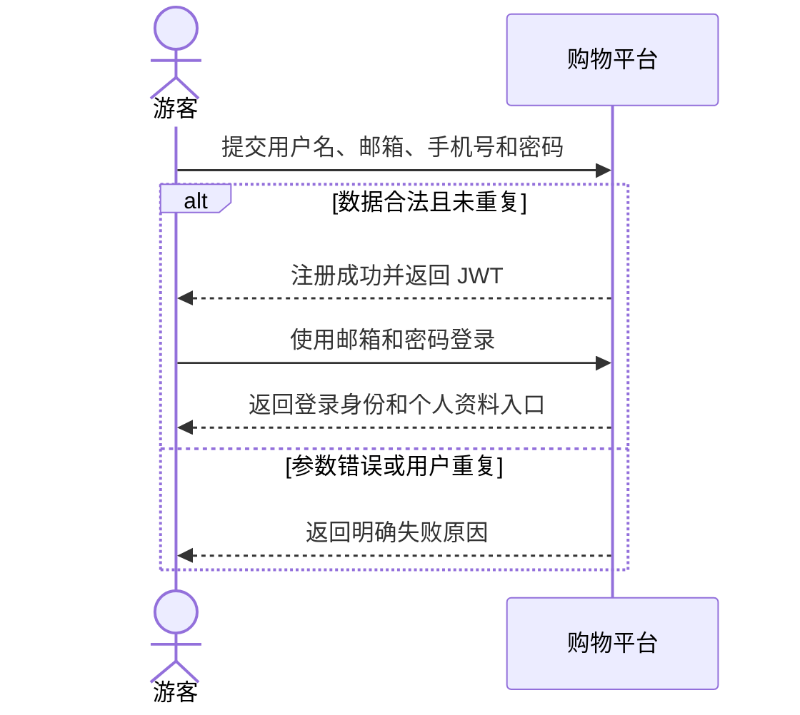

### 8.2 SYS-SEQ02 商品检索

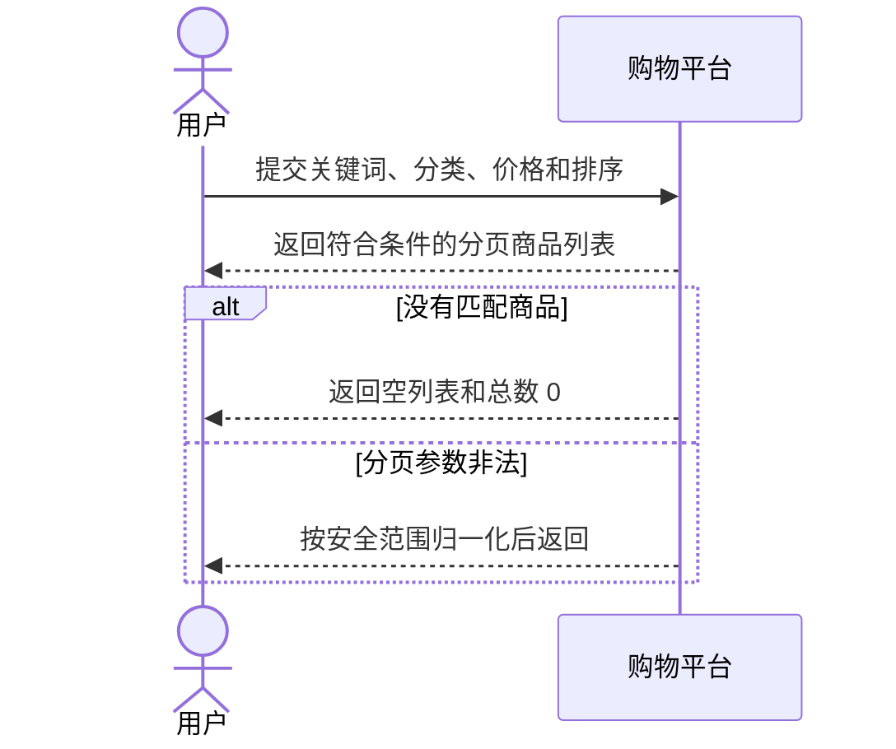

### 8.3 SYS-SEQ03 查看详情并加购

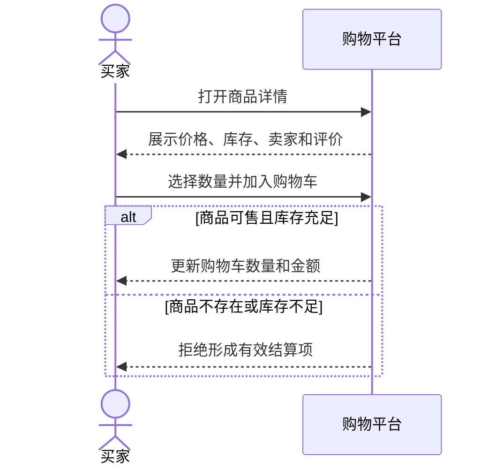

### 8.4 SYS-SEQ04 订单交易闭环

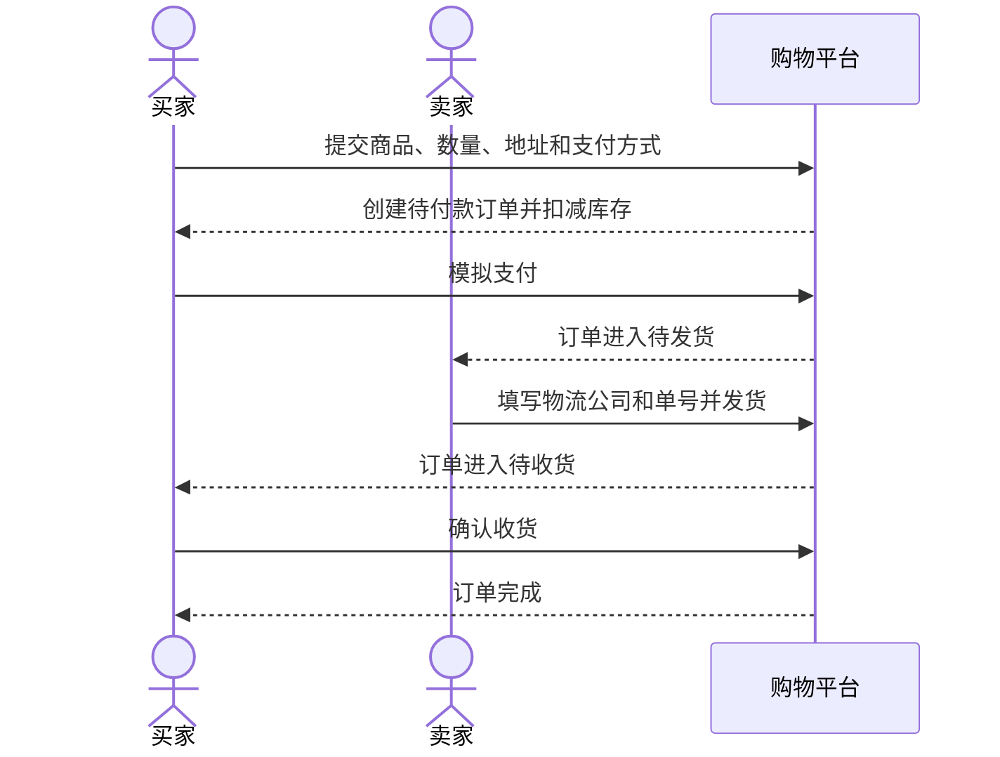

### 8.5 SYS-SEQ05 发布二手商品

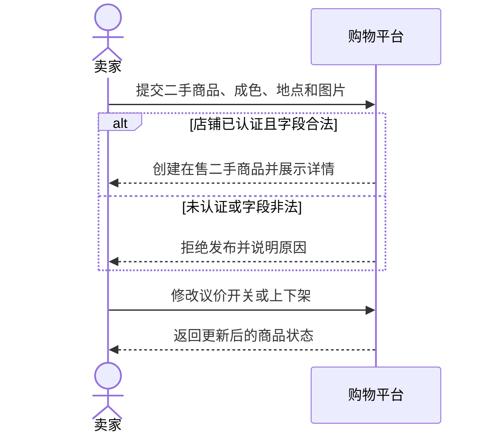

### 8.6 SYS-SEQ06 店铺认证与管理

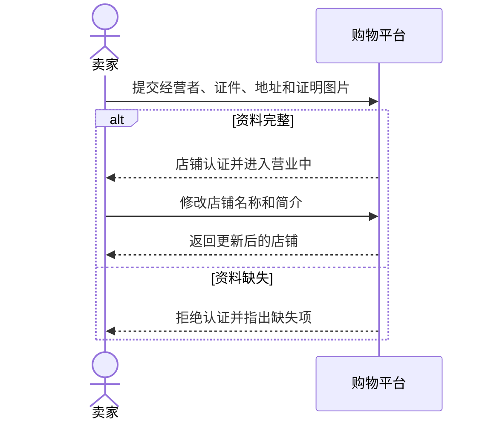

### 8.7 SYS-SEQ07 评价与回复

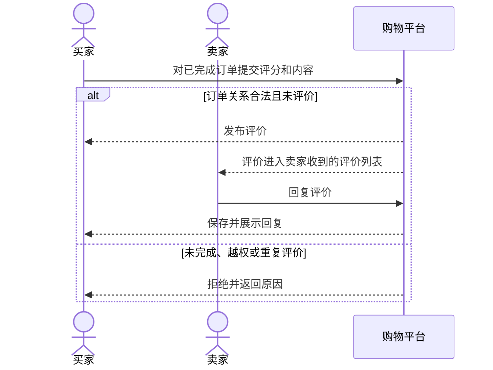

### 8.8 SYS-SEQ08 聊天议价

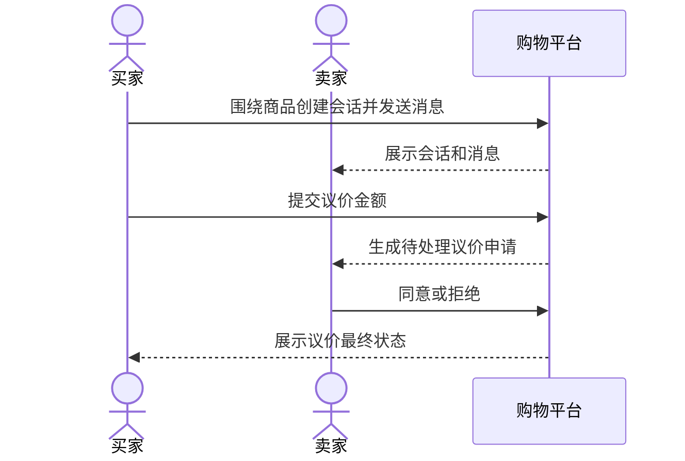

### 8.9 SYS-SEQ09 地址维护

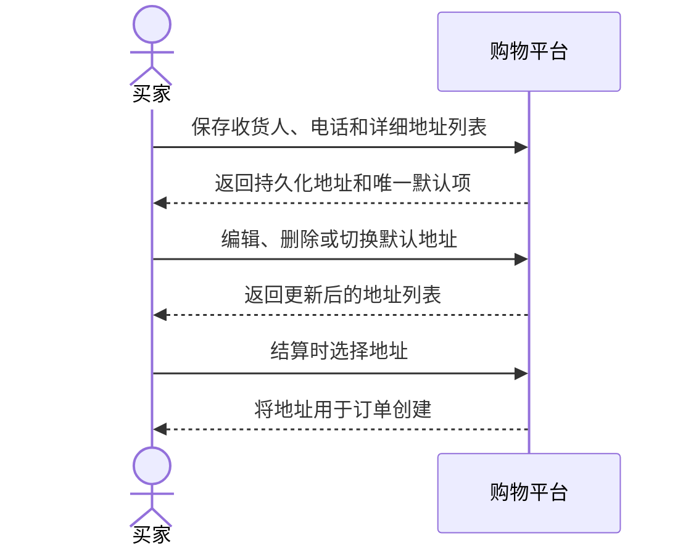

## 9. 非功能需求

| 编号 | 需求 | 验证方式 |
| --- | --- | --- |
| NFR01 | 密码使用 bcrypt 哈希，JWT 密钥生产环境不可使用默认值 | 安全单元测试 |
| NFR02 | 接口具有限流、安全响应头、CORS 和请求编号 | 安全测试/API 响应 |
| NFR03 | 创建订单与取消订单的库存变更使用事务 | API 主流程和取消流程 |
| NFR04 | 后端健康检查同时验证应用和数据库状态 | Docker/Kubernetes 健康检查 |
| NFR05 | 测试失败时不构建镜像、不部署 | GitHub Actions `needs` 门禁 |
| NFR06 | 商品列表基准测试检查 P95 和错误率阈值 | `04_tests/performance/k6-core-flow.js` |

## 10. 合格性与追溯

UC01-UC09 均须满足：需求说明完整、三级模型存在、代码可运行、单元/集成/E2E 测试有断言并通过。统一追溯关系见 `业务场景用例清单与追溯表.md`，最终测试统计见 `04_tests/reports/tests/测试报告-小学期.md`。
